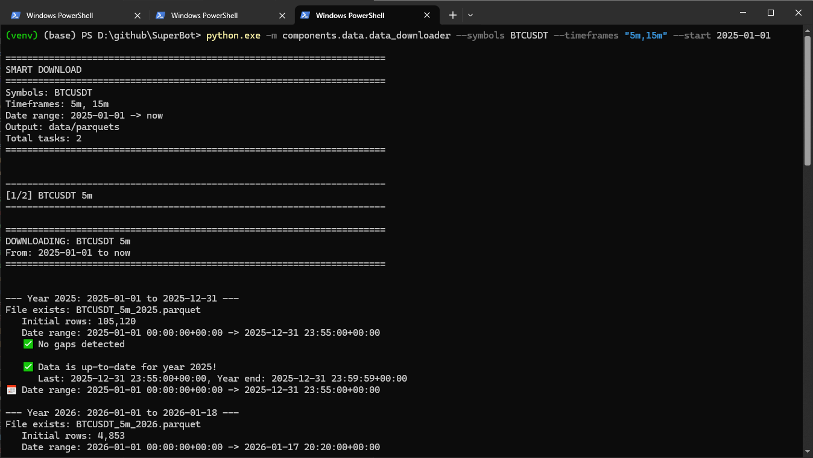
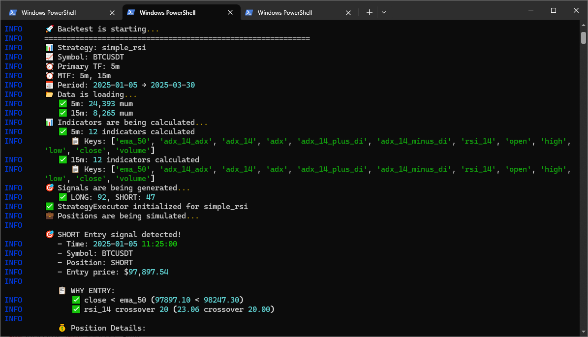
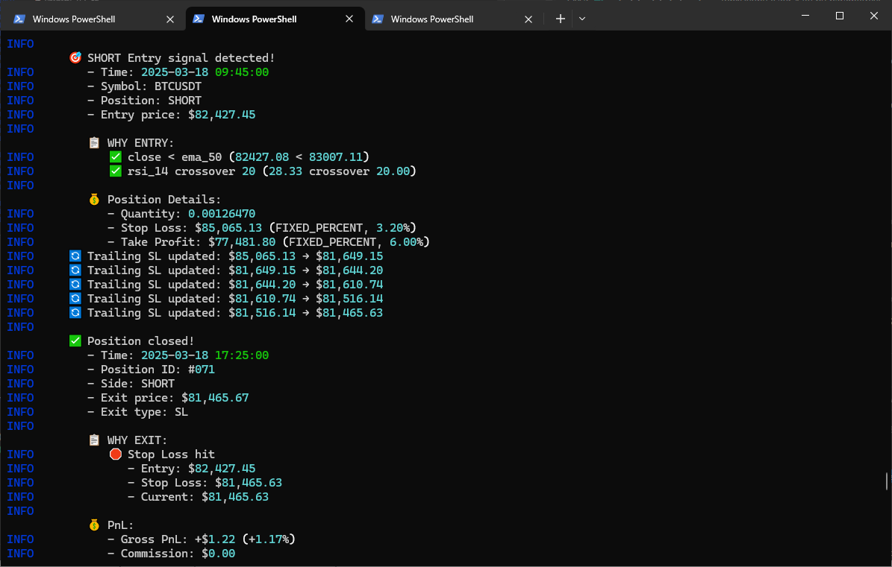

# 🤖 SuperBot Trading System

AI-powered, multi-exchange cryptocurrency trading platform with modular architecture.

## 🚀 Features

### 4 Independent Modules
- **Trading**: Live/Paper/Demo/Replay trading modes
- **Backtest**: Event-driven + Vectorized backtesting
- **AI**: XGBoost signal enhancement, regime detection, price prediction
- **WebUI**: Flask dashboard for control & monitoring

### Core Infrastructure
- ✅ Flexible backend selection (SQLite/PostgreSQL, Memory/Redis)
- ✅ Multi-timeframe (MTF) strategy support
- ✅ Rate limiting & error handling
- ✅ Graceful shutdown & state persistence
- ✅ Comprehensive logging (Türkçe + emoji)

### Exchange Support
- **Binance** (python-binance): Primary, Futures + Spot
- **Others** (CCXT): Kucoin, Bitget, OKX, Bybit

## 📦 Installation

### 🪟 Windows Prerequisites (Auto-Install)
Run these commands in PowerShell (Admin) to install essential tools.
**Note:** Windows Terminal is highly recommended for proper emoji/color support.

```powershell
# 1. Windows Terminal (For emojis & colored logs)
winget install -e --id Microsoft.WindowsTerminal

# 2. Git
winget install -e --id Git.Git

# 3. Miniconda (Recommended Python manager)
winget install -e --id Anaconda.Miniconda3 --override "/AddToPath=1"
```
*⚠️ Please restart your terminal after installation.*

### Requirements
- Python >= 3.12
- Git
- conda (recommended)

### Setup
```bash
# 1. Clone the repository
git clone https://github.com/zgongc/SuperBot.git
cd SuperBot

# 2. Create Environment
# Option A: Conda (Recommended)
#conda create -n superbot python=3.12
#conda activate superbot

# Option B: Python Venv
python -m venv venv
.\venv\Scripts\activate      # Windows
# source venv/bin/activate   # Linux/Mac

# 3. Install dependencies
pip install -r requirements.txt

# 4. Configure
cp config/.env.example config/.env
# Edit config/.env with your API keys
```

## 🎯 Quick Start

### 1. Start Daemon
```bash
python superbot.py
```

### 2. Start Trading (Paper Mode)
```bash
python superbot-cli.py trading start --mode paper
```

### 3. Run Backtest
```bash

# 1. Update the strategy file (e.g., simple_rsi.py in components\strategies\templates)
# Set your desired date range
        self.backtest_start_date = "2025-01-05T00:00"
        self.backtest_end_date = "2025-03-30T00:00"
# Set your desired timeframe
        self.primary_timeframe = "5m"
        self.mtf_timeframes = ['5m','15m']  # Primary timeframe MUST be in list


# 2. Download kline data if needed
# Example: Download 5m and 15m data for BTCUSDT from 2025-01-01 to present as parquet files
python.exe -m components.data.data_downloader --symbols BTCUSDT --timeframes "5m,15m" --start 2025-01-01

# 3. Run the backtest
python -m modules.backtest.backtest_engine --strategy simple_rsi.py

# Optional: Add --verbose for detailed backtest info
# python -m modules.backtest.backtest_engine --strategy simple_rsi.py --verbose
```

#### 📸 Example Screenshots

**Data Download:**


**Backtest Execution:**



### 4. Open WebUI
```
http://localhost:5000
```

## 📋 Trading Modes

| Mode | Description | API | Orders |
|------|-------------|-----|--------|
| **Paper** | Simulation | Real | Fake |
| **Demo** | Testnet | Testnet | Real (testnet) |
| **Live** | Production | Real | Real |
| **Replay** | Historical | None | Simulated |

## 🔧 Configuration

### Main Config: `config/main.yaml`
- Logging, performance, security settings

### Infrastructure: `config/infrastructure.yaml`
- Backend selection (cache, database, queue, eventbus)

### Connectors: `config/connectors.yaml`
- Exchange API credentials & settings

### Daemon: `config/daemon.yaml`
- Module lifecycle, scheduling, resource allocation

## 📊 Strategy Development

Create new strategy by extending `BaseStrategyTemplate`:

```python
from components.strategies.base_strategy_template import BaseStrategyTemplate

class MyStrategy(BaseStrategyTemplate):
    def __init__(self):
        super().__init__()
        self.strategy_name = "MyStrategy"
        self.mtf_timeframes = ['5m', '15m', '1h']
        # Configure entry/exit conditions, risk management, etc.
```

See examples:
- `components/strategies/templates/SMC_Volume.py`
- `components/strategies/templates/simple_rsi.py`

## 🧪 Testing

```bash
# Run all tests
pytest tests/

# Run specific module
python -m components.database.models
python -m core.rate_limiter
```

## 📚 Documentation

### 🤖 For AI Assistants (Claude Code)
**Start here every new session:**
1. **Context Guide**: `docs/claude/context_guide.md` ← **Quick reference, read first**
2. **Project Vision**: `docs/claude/PROJECT_VISION.md` ← **Why we're building this**
3. **Implementation Plan**: `docs/plans/implementation_plan.md` ← What we're building
4. **Development Principles**: `docs/plans/rules.md` ← How we work
5. **Claude Rules**: `docs/claude/claude_rules.md` ← Detailed coding rules
6. **Localization**: `docs/master/localization_guide.md` ← Turkish translations

### 📖 For Human Developers
- **Project Overview**: This README
- **Master Plan**: `docs/plans/implementation_plan.md`
- **System Architecture**: `docs/master/system_architecture.md`
- **Development Rules**: `docs/plans/rules.md`
- **AI Quick Start**: `docs/master/ai_quick_start.md`

## 🛠️ CLI Commands

```bash
# Daemon
superbot-cli daemon start|stop|status|restart

# Trading
superbot-cli trading start --mode paper|demo|live
superbot-cli trading stop
superbot-cli trading status

# Backtest
superbot-cli backtest run --strategy <name> --start <date> --end <date>

# Optimization
superbot-cli optimize --strategy <name> --trials 100

# AI
superbot-cli ai train --model signal_enhancer|regime_detector|price_predictor
superbot-cli ai models

# Data
superbot-cli data download --symbol BTCUSDT --timeframe 1h

# System
superbot-cli status
superbot-cli logs --tail 100
```

## 🏗️ Project Structure

```
SuperBot/
├── core/                   # Core services (config, logger, eventbus, cache, etc.)
├── components/             # Shared components
│   ├── database/          # ORM models, repositories, migrations
│   ├── data/              # Data pipeline, downloader, recorder
│   ├── exchanges/         # Exchange APIs (Binance, CCXT)
│   ├── indicators/        # Technical indicators
│   ├── managers/          # Business logic managers
│   └── strategies/        # Strategy templates & management
├── modules/               # Main modules (independent)
│   ├── trading/          # Live/Paper/Demo/Replay trading
│   ├── backtest/         # Backtesting engine
│   ├── ai/               # AI models & training
│   └── webui/            # Flask dashboard
├── config/               # Configuration files
├── data/                 # Runtime data (database, logs, parquets)
├── docs/                 # Documentation
├── superbot.py           # Daemon orchestrator
├── superbot-cli.py       # CLI interface
└── requirements.txt      # Python dependencies
```

## 🤝 Development

### Coding Standards
- Follow `docs/master/rules.md`
- Type hints required
- Türkçe log messages + emoji
- Header/footer in all files

### Branching
- `main`: Protected, production-ready
- `feature/<module>/<feature>`: Feature development

### Commit Format
```
type(scope): açıklama

# Types: feat, fix, refactor, docs, test, chore
# Example: feat(trading): add paper trading mode
```

## 📈 Performance

- **Vectorized Backtest**: ~10,000 trades/second
- **Event-Driven Backtest**: Realistic execution simulation
- **Rate Limiting**: Exchange API limits enforced
- **Resource Allocation**: Per-module CPU/memory limits

## 🔒 Security

- API keys encrypted with master key
- .env file for sensitive data (not in git)
- IP whitelisting for WebUI
- Rate limiting for all endpoints

## 📝 License

MIT License

Copyright (c) 2025-2026 SuperBot Team

## 💝 Support the Project

If SuperBot helps your trading journey, consider supporting its development! ☕

### Crypto Donations 🪙

| Asset | Network | Address |
|-------|---------|---------|
| **USDT** | TRC20 | `TS2ZbP4PYEQG1tmoBLvtZLkpWXq3yw7V4S` |
| **ETH/USDT** | ERC20 | `0x35ebcc6127527a738d8ec2a452822423c95fc45c` |

*Every contribution helps maintain and improve SuperBot. Thank you! 🙏*

## 🆘 Support

- **Issues**: GitHub Issues
- **Docs**: `docs/` directory

---

**Version**: 1.0.0  
**Last Updated**: 2025-11-12  
**Status**: ✅ Core implementation complete
